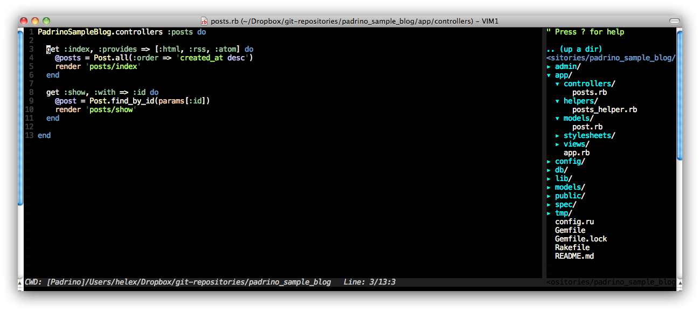

# Introduction #

Why another book about how to develop an application in Rails? But hold, this book should give you a
basic introduction how to develop a web application with [padrino](http://www.padrinorb.com/).
Padrino is a "The Elgant Ruby Web Framework". Is is based on [Rails](http://rubyonrails.org/) and
has some really nice features which makes it easier to create web application with less code and
more fun than to with it's father Rails

## Planning the application ##

On the following image you can image you can see the basic image of our application[^omnigraffle]:

[^omnigraffle]: You can use a classical stencil and paper to create mockups. But my handwriting is
so bad that I used [Omnigraffle](http://www.omnigroup.com/products/omnigraffle/ "Omnigraffle") with
the stencil extensions by [konigi](http://konigi.com/tools/omnigraffle-wireframe-stencils "konigi")
for writing wireframes.

## Your environment ##

Nowadays there are a bunch of IDEs out there: [RubyMine by JetBrains](http://www.jetbrains.com/ruby/
"RubyMine") (commercial) [Aptana RadRails](http://www.aptana.com/products/radrails "Aptana
RadRails") (free).  Or you can switch to some text editors [Textmate](http://macromates.com/
"Textmate") (commercial for Mac only), and [Vim](http://www.vim.org/ "vim"), which just run on every
server and under every terminal.

They all have there strength and weak sides. You have to experiment with them and take what fits
your needs. Due to the fact that I will do a bunch of really great command-line, I prefer to use a
"classical" **text editor** (see my [vim-settings repository on
github](https://github.com/matthias-guenther/vim-settings "vim-settings repository on github") if
you want to see which tool I use every day). In the end you have to decide what you want to take.
The main goal is that you are comfortable with it because you will mostly spend a lot of time with
it.

## Your browser ##

Here it is the as with the editors: There are many of them with great plugins out there for
web development. The mostly used browsers by Rails developer are:

- [Firefox](http://www.mozilla.org/en-US/firefox/new/ "Firefox"): Has a tons of plugins, is free,
  and with the magnificent [Firebug](http://getfirebug.com/ "Firebug") plugin, which let you inspect
  HTML document, measure the loading time of certain parts
- [Chrome](http://www.google.com/chrome "Chrome"): This browser is from Google (and I know many
  complains about data privacy).  It feels very fast and is shipped with *inspect element*[^inspect]
  to search the DOM[^dom]. It integrates the ability to debug JavaScript
- [Opera](http://www.opera.com/ "Opera"): Never used it, and don't know why I should (instead you
  tell my why and I will quote your words if they convince me)

There are more outside this main domain, like [Safari by Apple](http://www.apple.com/safari/ "Safari
by Apple"), [Lynx webbrowser](http://lynx.isc.org/ "Lynx webbrowser") (quite an experience to use
just a plain text browser) and the well known [Internet
Explorer](http://windows.microsoft.com/en-US/internet-explorer/downloads/ie "Internet Explorer").
Got out, grab the thing you want, and then gets your hands dirty.

[^inspect]: This is like a Firebug pendant of Firefox.
[^dom]: stands for *Document Object Model* and is a tree-like representation of the HTML page.

## Your system ##

"War... War never changes." this quote from my all-time favorite video game series [Fallout](
"Fallout") describes the battle of the different operating systems. I will briefly give you an
overview what you can take

- [Microsoft](http://www.microsoft.com/ "Microsoft"): This commercial operating system is installed
  on a huge range of computers. Much software and games are available for this operation system.
  Updates comes regularly, and everything is mostly intuitive. One big problem of Windows is it's
  mouse affinity: There are shortcuts and handy tips available. It is good for development, but
  lacks some comfort and design issues (you may not know, when you haven't worked with Linux).
- [Unix/Linux](http://en.wikipedia.org/wiki/Linux "Unix/Linux"): Highly configurable, Linux is
  shipped with a bunch of free software, and is Open Source. If you come from the Windows world,
  your brain will be burn like hell because everything is other. The program calls are other, you
  can install new software via *console*, the firewall is safe, and you can run most commands in the
  terminal (no annying mouse clicks anymore if you avoid graphical work). It is great for
  development because the great community are passionate about building software, and most software
  is Open Source so you don't have to pay for it.
- [Mac](http://www.apple.com/mac/ "Mac"): The core under it's has Unix, so you can reuse your Linux
  knowledge. Many people say that products from Apple are very expensive. In the contrast they
  provide you with an extreme stable, high configurable, and reliable system, which has some really
  nice software for it. If you haven't paid for software in your life, some piece of software will
  make you want to pay for it because. In mine eyes, Mac is the gap between Windows and Linux: It
  can be changed in any any way you want (Linux) and has some really good software for it
  (Microsoft). Development on this machine is extreme good, because it underlines the needs of
  developers.

There is a war between these three operation systems, and which you chose is a matter of taste. As
you can see on this pictures, I'm using a Mac. I like and love (and yeah, I had to pay a lot of
patience and learning to come to the point where I can say, that it was worth paying much money for
the hardware).
