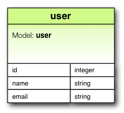
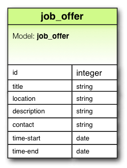
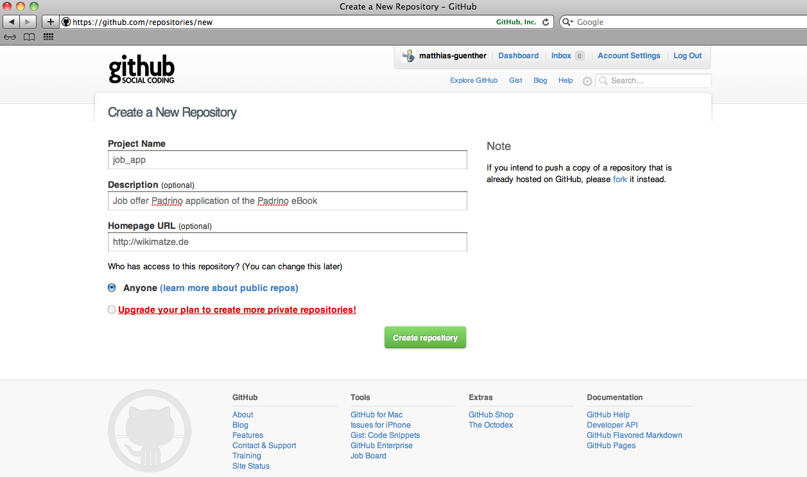

# Job Board Application

There are more IT jobs out there than there are skilled people available. It would be great if we could have the possibility to offer a platform where
users can easily post new jobs vacancies to recruit people for their company. This example job vacancy board is the software we will be building with Padrino. We will apply **K.I.S.S**[^KISS] principle, so we will keep maintain a very easy and extensible design.

First, we will take a look at the basic design of our application, afterwards we are going to implement our ideas using the Padrino framework.

[^KISS]: Is an acronym for *Keep it simple and stupid*.

## Creation of the models

### User data model

There are many different ways how to develop a user entity for your system. A user in our system will have an *unique*
identification number **id** which is an integer (also useful for indexing our database), a **name** and an **email** both of which are strings.

### Job vacancy data model

A job vacancy consists of the following attributes:

- title: the name of the job position
- location: where the job is
- description: important details about the position
- contact: an email address is sufficient
- time-start: what is the earliest date when you can start
- time-end: nothing lives forever - even a job vacancy

## Basic crafting of the application

In our first attempt we will start with generating a new project with the canonical `padrino` command (see section \ref{section 'Hello
world'}) but this time it has a bunch of new options:

    $ cd ~/padrino_projects
    $ padrino g project job_app -t rspec -d activerecord -a sqlite -e haml -c sass -s jquery

Explanation of the new fields:

- **g**: is shortcut for generate (who doesn't love shortcuts to save your fingers from RSI)
- **-t rspec**: using the [RSpec](https://github.com/dchelimsky/rspec/wiki/get-in-touch "RSpec") testing framework (an explanation about this will follow later)
- **-d activerecord**: using activerecord as the orm[^orm]
- **-a sqlite**: specifying the orm[^orm] database adapter is [sqlite](http://www.sqlite.org/ "SQLite") - easiest database to install / configure and is ideal for beginning development plus it doesn't consume much system resources on you development machine
- **-e haml**: using [Haml](http://haml-lang.com/ "Haml")[^haml] markup as a *renderer* to describe HTML in cleaner and faster way
- **-c sass**: using [Sass](http://sass-lang.com/ "Sass")[^sass] for describing the CSS[^css] of the application, Sass offers numerous benefits over plain old CSS
- **-s jquery**: defining the Javascript library we are using - for this app will be using the ubiquitous
  [jQuery](http://jquery.com/ "jQuery") library

[^haml]: stands for *HTML Abstraction Markup Language*
[^css]: stands for *Cascading Style Sheets*
[^orm]: stands for *Object Relational Mapper*
[^sass]: stands for *Syntactically Awesome Style Sheets*

If this commands works, you should have a nice green success message.
Now let us take a look at what *gems* have been specified in the
automatically generated *Gemfile* by navigating into the `job_app` project
directory and opening the Gemfile with your favourite text editor.  You
shoulde see the following within the *Gemfile*:

    source :rubygems

    # Project requirements
    gem 'rake'
    gem 'sinatra-flash', :require => 'sinatra/flash'

    # Component requirements
    gem 'sass'
    gem 'haml'
    gem 'activerecord', :require => "active_record"
    gem 'sqlite3'

    # Test requirements
    gem 'rspec', :group => "test"
    gem 'rack-test', :require => "rack/test", :group => "test"

    # Padrino Stable Gem
    gem 'padrino', '0.10.5'

Later, when *the time comes*, we will add extra gems, for now though we'll grab the current gems using with Bundler[^bundler] by running at the command line:

    $ bundle install

[^bundler]: recall that bundler is a service to install all the required gems for a certain project.

Recall from section (\ref{section 'git - put your code under version control'}) that we need to put our achievements under version control:

    $ git init
    $ git add .
    $ git commit -m 'first commit of a marvelous padrino application'

Can you remember what the git commands are doing? The following explanation will refresh your memory if you have forgot, don't
worry it'll become second nature to you in due course:

- `git init` - initialize a new git repository
- `git add .` - add recursively all files to staging
- `git commit -m ` - check in your changes in the repository

Because we are hosting our application on [github]( "github") we need to push the project onto the platform. (TODO: installation
explanation of github, maybe just a link)

    $ git remote add origin git@github.com:matthias-guenther/job_off_app.git
    $ git push origin master

Instead of *matthias-guenther* you have to replace this phrase with your personal github account name. Now your repository is
online. To write some documentation about what the whole project is about we should add a README.md to the project:

    $ git add README.md
    $ git commit -m 'add README'
    $ git push

The md extension means this is in Markdown format you can however use many other formats.

If you want to see how the project should be looking on Github, just checkout the
[sources](https://github.com/matthias-guenther/job_app "sources").

### Basic layout - controller and routing

The first thing we will do, is to check out a new branch for this section. Let's fire up the console and create a new branch.
Creating a new branch is not a necessity but it is considered good practice when implementing new features or fixing bugs and
it makes it easier for you if things go wrong.

    $ git branch basic-layout
    $ git checkout basic-layout

With `git branch <name>` we create a new branch (in this example one with the name *basic-layout*) and with `git checkout <name>`
we switch to this branch and all changes we make will only be visible in this branch. To get an overview of all available branches
type in `git branch -a`

    $ git branch -a
    * basic-layout
      master

Lets create our first version with static content only. We are presented early with a question; where will be my *index.html* page? Because we are not
working with controllers, the easiest thing is to put the *index.html* directly under the public folder in the project. 

This book has the intention to be up-to-date so we fill our index page with the latest
[HTML5](http://en.wikipedia.org/wiki/HTML5 "HTML5") standards, add the following into your index.html file:

    <!DOCTYPE html>
    <html lang="en-US">
      <head>
        <title>Start Page</title>
      </head>
      <body>
        
Hello, Padrino

      </body>
    </html>

Explanation of the parts:

- `<!DOCTYPE html>` -  the *document type* tells the browser which HTML version should be used for rendering the content correctly
- `head` - specifying meta information like title, description, and ; this is also the place to where to add CSS and JavaScript files
- `body` - section for displaying the main content of the page

This used to be the way websites were created in the beginning of the web - plain old static content, today things are a
little more dynamic so our static app won't last long.

We can take a look at our new page by firing up Padrino by running the followin at the command line:

    $ padrino start

You should see a message telling you that Padrino has taken the stage, you should now be able to view the feshly created index
page by visiting [http://localhost:3000/index.html](http://localhost:3000/index.html) in your favourite browser.
 
Since we are done with the small feature, it is time to push our branch to the remote repository on Github but first of all we
need to commit our changes.  The following commands will add the index.html page to the staging area the commit the changes,
finally we push the code up to Github.

    $ git add public/index.html
    $ git commit -m "Adding initial index page."
    $ git push origin basic-layout

If you cannot run the Git commands above because the Padrino server is still running either open another terminal or stop
the server to bring you back to the command prompt by pressing `ctrl+c`.

You may have though it a little odd that we had to manually use index.html in the url when viewing our start page, this is
because our app currently has now idea about routing.  Lets add some basic routes for displaying our home-, about-, and contact-page with the help of controllers.

Since Padrino is heavily influenced by Rails it has a script to help us make controllers called **controller**.  This commands take the name of
the controller as a parameter.

    $ padrino g controller page

The output of this command is:

    create  app/controllers/page.rb
    create  app/helpers/page_helper.rb
    create  app/views/page
     apply  tests/rspec
    create  spec/app/controllers/page_controller_spec.rb

If you have questions about the output above, please drop me a line - I think it is so clear that it doesn't need any explanation
about it.

Lets take a look at what the script generated for us `app/controller/page.rb`:

    JobApp.controllers :page do
      # get :index, :map => "/foo/bar" do
      #   session[:foo] = "bar"
      #   render 'index'
      # end

      # get :sample, :map => "/sample/url", :provides => [:any, :js] do
      #   case content_type
      #     when :js then ...
      #     else ...
      # end

      # get :foo, :with => :id do
      #   "Maps to url '/foo/#{params[:id]}'"
      # end

      # get "/example" do
      #   "Hello world!"
      # end

    end

It's an empty file with a bunch of comments which gives you some example about how you can define own own routes. Lets define the
home, about, and contact actions.

    JobApp.controllers :page do
      get :index, :map => '/page/index' do
        render 'page/index'
      end

      get :about, :map => '/page/about' do
        render 'page/about'
      end

      get :contact, :map => '/page/contact' do
        render 'page/contact'
      end

    end

As always, let me explain what these lines of code means:

- `JobApp.controller :page` - define for our JobApp application the name space for the *page* controller
- `do ... end` - defines a block in ruby - please checkout LINK to learn more about blocks in ruby. It is important to understand
  this syntax because they are used in Padrino everywhere
- `get :index, :map => '/page/index'` - the HTTP command *get* starts the declaration of the route followed by the *index* action
  (in the form of a Ruby symbol FOOTNOTE), and is finally mapped under the explicit URL */page/index*
- `render 'page/index'` - define the route for the view/template which is rendered when the URL gets the *get* request for the
  route - the views are placed under *app/views/<controller-name>/<action-name>.<html|haml>*

If you get confused about what routes you have defined for your application just call `padrino rake routes` - this nice command
hunts through your application looking for delicious routes and gives you a nice overview about **URL, REQUEST**, and **PATH** in your
terminal:

    $ padrino rake routes
    => Executing Rake routes ...

    Application: JobApp
        URL                  REQUEST  PATH
        (:page, :index)        GET    /page/index
        (:page, :about)        GET    /page/about
        (:page, :contact)      GET    /page/contact

Finally let's track our changes and commit our changes to the repository on github

    $ git add .
    $ git commit -m 'creating basic routes.'
    $ git push

### Basic layout - Haml

Although we are now able to put content (albeit static) on our site, it would be nice to have some sort of basic styling on our web page. First we
need to generate a basic template for all pages we want to create.  Lets create *app/views/application.haml*

    !!! 5
    %html
      %head
        %title
          = "Job Board Application"
      %body
        = yield

Let me explain the parts of the Haml template:

- `!!! 5` - placeholder for the doctype
- `%html` - will produce the opening (*<html>*) and closing tag (*</html>*). Other element within this tag have to put in the next
  line with the indentation of two spaces
- `= "Job Board Application"` - printing plain text into the view
- `= yield` - is responsible for putting the content of each page (like *contact.haml* or
  *about.haml*) into the layout

The above part will be used to create the following html file

    <!DOCTYPE html>
    <html>
      <head>
        <title>
          Job Board Application
        </title>
      </head>
      <body>
        

          The main part of your home page
        

      </body>
    </html>

### Basic layout - Twitter Bootstrap

The guys at Twitter were kind enough to make their CSS framework **Twitter Bootstrap** available for everyone to use by licensing
it as an open source project, it is available from Github at:
[public repository on Github](https://github.com/twitter/bootstrap/ "repository on Github"). Thank's to
[@arthur_chiu](http://twitter.com/#!/arthur_chiu "@arthur_chiu"), we use padrino-recipes :

    $ padrino g plugin bootstrap

Next we need to include the style sheet in our application. Edit *app/layouts/application.haml*:

    !!! 5
    %html
      %head
        = stylesheet_link_tag 'bootstrap.min', :media => 'screen'
        %title
          = "Job Board Application"
      %body
        = yield

The *stylesheet_link_tag* points to the *bootstrap.min.css* in you app *public/stylesheets* directory and will create a link to
this stylesheet.

### Navigation

Next we want to create the top-navigation for our application. We need some of our own CSS to style the custom parts of our application
without changing the twitter-bootstrap layout files. Let's create the *app/stylesheets/application.sass*

    body
      font: 18.5px Palatino, 'Palatino Linotype', Helvetica, Arial, Verdana, sans-serif
      text-align: justify

    nav ul
      list-style: none
      padding: 0
      li
        display: inline
        margin: 0
        padding-right: 25px
        padding-left: 30px
        clear: none
        float: left
        text-decoration: none
        a
          border-bottom: 0px
        a:hover
          color: blue
          text-decoration: dotted

    .site
      max-width: 900px
      min-height: 600px
      padding: 20px
      line-height: 1.8em

    p
      font-size: 95%

    .clearer
      clear: both

[Sass](http://sass-lang.com/ "Sass") is the CSS counterpart to Haml although the two projects were recently split apart into seperate gems.  Sass eases the creation of CSS by letting you use a cleaner syntax and also allows you to use variables and reusable mixins. Every time you make changes in the
Sass file, it automatically detects the changes and compiles the Sass file to CSS.
Of course we have to add the application.css in our template as well as adding our horizontal navigation as a typical ul/li
combination

    !!! 5
    %html
      %head
        = stylesheet_link_tag 'bootstrap.min', :media => 'screen'
        = stylesheet_link_tag 'application'
        %title
          = "Job Board Application"
      %body
        .container
          %h1
            Job Offer Board
          %nav{:role => 'navigation'}
            %ul
              %li
                = link_to 'Home', url_for(:page, :index)
              %li
                = link_to 'About', url_for(:page, :about)
              %li
                = link_to 'Contact', url_for(:page, :contact)
              %li
                = link_to 'Help', url_for(:page, :help)
          .clear
          .site
            = yield

Explanation of the new parts
- `%nav{:role => 'navigation'}` - will produce the html nav tag and takes the Ruby hash `{:role => navigation}` as an additional
  parameter - the output in HTML is `<nav role='navigation'>`
- `.clear` - is a shortcut for a div with a class named *clear* `

'
- `link_to` - the first argument is the name of the link and second is the URLs
- `url_for` - will create the link-tag - for example `url_for(:page, :contact)` is using **named parameters** which were specified
  in our *page-controller*.  The scheme for this is `<:controller>, <:action>` - you can use these settings in your whole
  application to create clean and encapsulated URLs

### Writing first tests

Now it is time to begin developing our code with tests. As mentioned in the introduction, we will *describing the behavior
of code*[^bdd] with the testing framework [RSpec](http://rspec.info/ "RSpec").

As we created the controller with `padrino g controller page` Padrino created a spec file under *spec/app* for us automatically. So
let's examine *spec/app/controller/page_controller_spec.rb*:

    require 'spec_helper'

    describe "PageController" do
      before do
        get "/"
      end

      it "returns hello world" do
        last_response.body.should == "Hello World"
      end
    end

- `spec_helper` - is a file to load commonly used functions so that they can reused in other specs
- `describe block` - this block describes the context for our tests
- `before do` - the content of this block will be called before the execution of each `it "..." do`
- `it "..." do` - consists of the textual description of the test and writes our expectation to our application code

Now let's run our tests with `rspec spec/app/controllers/page_controller_spec.rb` and see the daunting (and long) output in the terminal:

    PageController
      returns hello world (FAILED - 1)

    Failures:

      1) PageController returns hello world
         Failure/Error: last_response.body.should == "Hello World"
           expected: "Hello World"
                got: "<!DOCTYPE html>\n<html>\n<head>\n  \n</head>\n<body>\n  <h2>Sinatra doesn&rsquo;t know this ditty.</h2>\n  
\n    Try this:\n    <pre>get '/' do\n  \"Hello World\"\nend</pre>\n  
\n</body>\n</html>\n" (using ==)
           Diff:
           @@ -1,2 +1,21 @@
           -Hello World
           +<!DOCTYPE html>
           +<html>
           +<head>
           +  
           +</head>
           +<body>
           +  <h2>Sinatra doesn&rsquo;t know this ditty.</h2>
           +  

           +    Try this:
           +    <pre>get '/' do
           +  "Hello World"
           +end</pre>
           +  

           +</body>
           +</html>
         # ./spec/app/controllers/page_controller_spec.rb:9:in `block (2 levels) in <top (required)>'

    Finished in 6.02 seconds
    1 example, 1 failure

    Failed examples:

    rspec ./spec/app/controllers/page_controller_spec.rb:8 # PageController returns hello world

Our tests gets the root index out our application (`get "/"`) and we expect that the response from this request should be
*Hello world* (`last_response.body.should == "Hello World"`). Because we changed the routes and the layout of our
application, this test failed (it's **red**). Let's change the code of our spec to pass the test (make it **green**):

    require 'spec_helper'

    describe "PageController" do

      describe "'GET' index" do
        it "should be success" do
          get  '/page/index'
          last_response.status.should == 200
        end
      end

    end

Next we run our tests again with `rspec spec/app/controllers/page_controller_spec.rb`:

    PageController
      'GET' index
        should be success

    Finished in 5.94 seconds
   1 example, 0 failures

[^bdd]: Which is called Behavior Driven Development and has nearly the same features as Test Driven Development (TDD)

#### Red-Green Cycle

In Behavior Driven (as well as in Test Driven) Development it is important to write a failing test (so that you get a **red**
color when running the test) first so that you know you really are testing something meaningful. Next we change our code base to make it pass (you get a **green** when running the test). The scheme
for this approach is test first, then the implementation. But this little shift in mind set when working on production code helps you
to think more about the problem and how to solve it.

Once you have green code, you are in the position to refactor your code where you can remove duplication and enhance design without changing the
behavior of our code.

